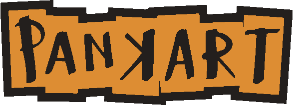

# Projet Pankart

> This repository is for me to store relevant files and links for this project, it is being worked on during the current academic years (2020-2021) at the HEPL from Liège, Belgium.

---

## I. Présentation

Le groupe Pankart est un groupe de musique Rock Celtique belge <u>engagé</u> et <u>dénonciateur</u>.

Leur premier album, sorti en avril 2020 a remporté un concours européen la même année.

Gigstarter artist of the Year 2020

##### **Vous pouvez retrouver Pankart ici :**

1. sites principaux :
   
   - [Gigstarter](https://www.gigstarter.be/artists/pankart)
   
   - [Youtube](https://www.youtube.com/channel/UC7XhVCykTsQEJp6P0eTVfmQ)
   
   - [Lampli](https://lampli.be/artist-profile/pankart/)

2. réseaux sociaux :
   
   - [Facebook](https://www.facebook.com/PanKart/)
   
   - [Instagram](#)

3. music streaming :
   
   - [Spotify](https://open.spotify.com/artist/4pCCFM2BXTOekMx1RksIkf)
   
   - [Soundcloud](https://soundcloud.com/pankartband?utm_source=embed&utm_medium=icon)
   
   - [Deezer](https://www.deezer.com/track/934885562?utm_source=deezer&utm_content=track-934885562&utm_term=108514421_1587654068&utm_medium=web)
   
   - [Google Play](https://play.google.com/store/music/album/PanKart_PanKart?id=Blepwaz6w7mrgsxprc2i6hq3sy4&gl=BE)
   
   - [Apple Music](https://music.apple.com/be/album/pankart-ep/1509177982?l=fr)
   
   - [Amazon](https://www.amazon.fr/PanKart-Pankart/dp/B08797KN6B/ref=sr_1_1?dchild=1&keywords=Pankart&qid=1587653912&s=dmusic&search-type=ss&sr=1-1)

#### II. Public cible

Le groupe Pankart fait de la musique pour tout public confondu, 
PAS SEULEMENT LES 12-13 ANS !

## III. Plan du site

1. <u>Le concept (les styles)</u>
   
   Le site **DOIT** rester moderne

2. <u>La structure</u>
   
   - <u>nav</u> (toute la navigation <u>devrait</u> coller en haut)
   
   - news 
     
     - time line (blog style)
       
       - agenda des évènements à venir
       
       - petite image + texte descriptif pour chaque post
     
     - coups de gueule
     
     - presse (apparitions TV, mags, journal, etc...)
   
   - bio
     
     - une page par membre
   
   - galerie
     
     - photos, videos, etc...
     
     - chansons
       
       - lyrics
     
     - (pankart clicker)
   
   - merch (doit être désactivable)
     
     - promotion d'un projet / d'une cause
     
     - form (pour achat)
   
   - contact
     
     - form
       
       - disponibilités
     
     - plateformes (Gigstarter, Lampli.be, etc...)

3. <u>Le contenu</u>
   
   - logo + musique en "flash" lorsqu'on arrive sur le site.
   
   - musique atténuée lorsqu'on scroll passé la première section.
   
   - ? un music player attaché à la navigation? (au moins pour les bountons "stop", "suivant/précédent") (*voir moodboard*)
   
   - 

4. <u>La stratégie</u>
   
   - responsive... comme tous les sites modernes
   
   - site eco (meilleur et en rapport avec les valeurs du groupe)
   
   - site DEVRAIT être <u>AUTONOME</u> (pouvoir facilement l'étendre (articles, médias, etc))

5. [**moodboard**](https://app.milanote.com/1Ld0xc1VMS4p2t?p=lDBOsbb3mC7)

6. [**design (wireframe)**](https://louis868026.invisionapp.com/freehand/wireframe-7jAmuXK8C)

---

#### Useful links

for more informations about this project : 
[GitHub - hepl-dw/projet-pankart: Description, assets and other information for a school project @ HEPL, Liège, Belgium](https://github.com/hepl-dw/projet-pankart)
